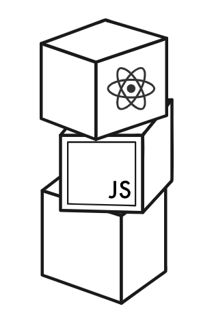

# Full Stack Open — University of Helsinki

Coursework for the [Full Stack Open](https://fullstackopen.com) course by the University of Helsinki.



## Repository structure

| Part | Topic | Project | Stack |
|------|-------|---------|-------|
| 0 | Fundamentals of Web apps | [`part0/`](part0/) | Mermaid sequence diagrams |
| 1 | Introduction to React | [`part1/courseinfo/`](part1/courseinfo/) | React, Vite |
| 2 | Communicating with server | [`part2/courseinfo/`](part2/courseinfo/) | React, Vite |
| 3 | Programming a server with Node.js and Express | [`part3/phonebook-backend/`](part3/phonebook-backend/) | Node, Express |
| 4 | Testing Express servers, user administration | [`part4/bloglist-backend/`](part4/bloglist-backend/) | Node, Express, MongoDB, Mongoose, Jest, Supertest, JWT |
| 5 | Testing React apps, custom hooks | [`part5/bloglist-frontend/`](part5/bloglist-frontend/) | React, Vite, React Router, Styled Components, Vitest, Playwright |
| 6 | Advanced state management | [`part6/`](part6/) | React, Vite, Zustand, TanStack Query, Context API |
| 7 | Custom hooks, extending the bloglist | [`part7/`](part7/) | React, Vite, Zustand, React Router, Comments |
| 8 | GraphQL | [`part8/`](part8/) | Apollo Server, GraphQL, MongoDB, React, Apollo Client |
| 9 | TypeScript | [`part9/`](part9/) | TypeScript, Express, Zod, React, Material UI |
| 10 | React Native | [`part10/`](part10/) | React Native, Expo, Apollo Client, GraphQL |

## Part 4 — Bloglist backend

REST API for a blog list application, with user administration and token-based authentication.

- Express + MongoDB (Mongoose)
- JWT authentication (`login`, token/user extraction middleware)
- `bcrypt` password hashing, controller-level validation
- Jest + Supertest integration tests

### Run

```bash
cd part4/bloglist-backend
npm install
# copy .env.example to .env and fill in a real MONGODB_URI and TEST_MONGODB_URI
npm run dev    # start the server (port 3003)
npm test       # run tests (needs the test database)
npm run lint   # ESLint
```

## Part 5 — Bloglist frontend

Single-page React frontend for the blog list application.

- React + Vite + React Router (`/`, `/blogs/:id`, `/login`, `/create`)
- Styled Components UI (exercises 5.29–5.31)
- Vitest + React Testing Library unit tests
- Playwright end-to-end tests

### Run

```bash
cd part5/bloglist-frontend
npm install
npm run dev        # dev server, proxies /api to localhost:3003
npm test           # unit tests
npm run test:e2e   # Playwright (needs backend running + npx playwright install)
npm run lint
```

## Part 6 — State management

Three small apps built in sequence (exercises 6.1–6.22):

- [`part6/unicafe/`](part6/unicafe/) — the unicafe feedback counter rebuilt with **Zustand** (6.1)
- [`part6/anecdotes/`](part6/anecdotes/) — an anecdotes app using **Zustand + json-server**, with Vitest tests (6.2–6.15)
- [`part6/query-anecdotes/`](part6/query-anecdotes/) — the same app rebuilt with **TanStack Query + React Context** (6.16–6.22)

### Run

```bash
cd part6/anecdotes           # or part6/query-anecdotes
npm install
npm run server               # start json-server (http://localhost:3001)
npm run dev                  # start the dev server
npm test                     # anecdotes only (6.12–6.15)
```

## Part 7 — Custom hooks & extending the bloglist

- [`part7/anecdotes/`](part7/anecdotes/) — custom hooks (`useField`, `useAnecdotes`) for the anecdotes app (7.1–7.6)
- [`part7/bloglist/`](part7/bloglist/) — frontend + backend together, extended with Zustand, users views, comments and an error boundary (7.7–7.20)

### Run

```bash
# anecdotes
cd part7/anecdotes
npm install
npm run server    # json-server on :3001
npm run dev

# bloglist backend
cd part7/bloglist/backend
npm install
npm run dev       # port 3003 (needs MongoDB)

# bloglist frontend
cd part7/bloglist/frontend
npm install
npm run dev       # proxies /api to :3003
```

## Part 8 — GraphQL

A "library" app built with GraphQL (exercises 8.1–8.26):

- [`part8/library-backend/`](part8/library-backend/) — Apollo Server + Express + MongoDB, with users/JWT, a `bookAdded` subscription and a dataloader for the n+1 problem
- [`part8/library-frontend/`](part8/library-frontend/) — React + Apollo Client, with authors/books views, login, genre filtering and subscriptions

### Run

```bash
# backend (needs MongoDB)
cd part8/library-backend
npm install
npm run dev       # http://localhost:4000

# frontend
cd part8/library-frontend
npm install
npm run dev       # http://localhost:5173
```

## Part 9 — TypeScript

- [`part9/first-steps/`](part9/first-steps/) — BMI + exercise calculators and a typed Express backend (9.1–9.7)
- [`part9/courseinfo/`](part9/courseinfo/) — course info app with exhaustive type checking (9.15–9.16)
- [`part9/diaries/`](part9/diaries/) — flight diaries app: fetch/add, error handling, typed forms (9.17–9.20)
- [`part9/patientor/`](part9/patientor/) — full-stack patient-records app, backend + frontend (9.8–9.14, 9.21–9.30)

## Part 10 — React Native

A mobile "rate repository" app built with React Native and Expo (exercises 10.1–10.27):

- [`part10/rate-repository-app/`](part10/rate-repository-app/) — repository list (search, ordering, infinite scroll), sign in/up (Formik + Yup), single-repository view with reviews, "my reviews" with delete, and a GraphQL backend

### Run

```bash
cd part10/rate-repository-app
npm install
npx expo start     # scan the QR code with Expo Go, or press a/i for an emulator
```

## Course content

### Part 0: Fundamentals of Web apps
- General info
- Fundamentals of Web apps

### Part 1: Introduction to React
- Introduction to React
- Javascript
- Component state, event handlers
- A more complex state, debugging React apps

### Part 2: Communicating with server
- Rendering a collection, modules
- Forms
- Getting data from server
- Altering data in server
- Adding styles to React app

### Part 3: Programming a server with NodeJS and Express
- Node.js and Express
- Deploying app to internet
- Saving data to MongoDB
- Validation and ESLint

### Part 4: Testing Express servers, user administration
- Structure of backend application, introduction to testing
- Testing the backend
- User administration
- Token authentication

### Part 5: Testing React apps, custom hooks
- Login in frontend
- props.children and proptypes
- Testing React apps
- End to end -testing

### Part 6: Advanced state management
- Flux-architecture and Zustand
- Communicating with the server (json-server)
- React Query (TanStack Query)
- React Context and the useReducer hook

### Part 7: React router, styling app with CSS and webpack
- React-router
- Custom hooks
- More about styles
- Webpack
- Class components, E2E-testing
- Exercises: extending the bloglist

### Part 8: GraphQL
- GraphQL-server
- React and GraphQL
- Database and user administration
- Login and updating the cache
- Fragments and subscriptions

### Part 9: Typescript
- Background and Introduction
- First Steps with Typescript
- Typing express app
- React with types
