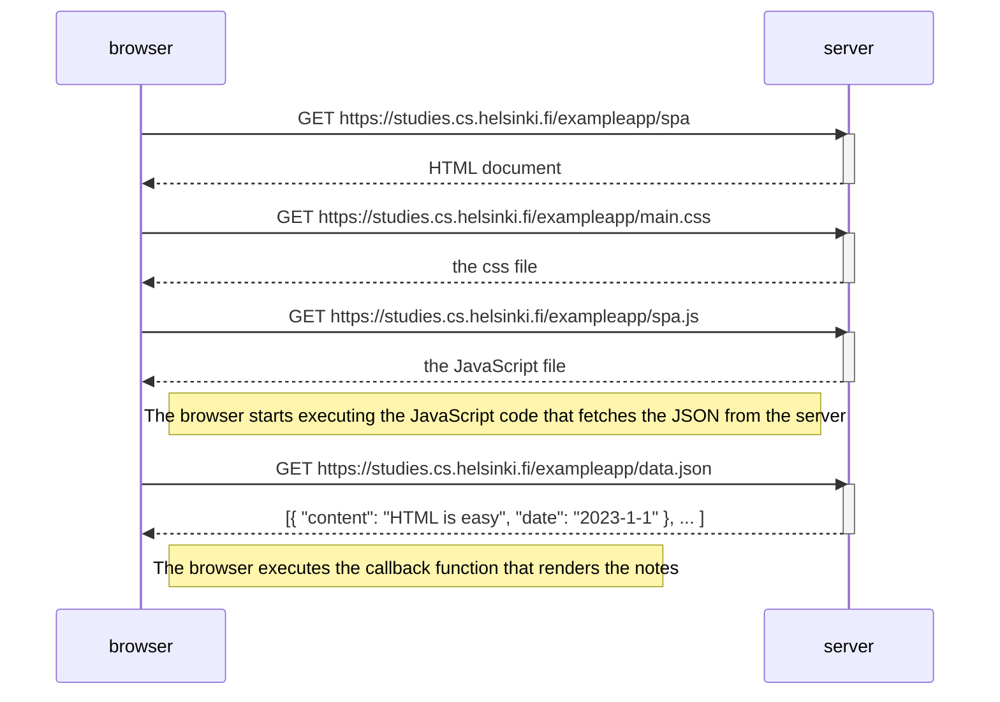

# 0.5: Single page app diagram

Situation: the user opens the single-page app version of the notes app at
`https://studies.cs.helsinki.fi/exampleapp/spa`.

The page load looks almost the same as the regular version, except the JavaScript
file is `spa.js` instead of `main.js`. All the rendering is done by JavaScript
after the data is fetched.

