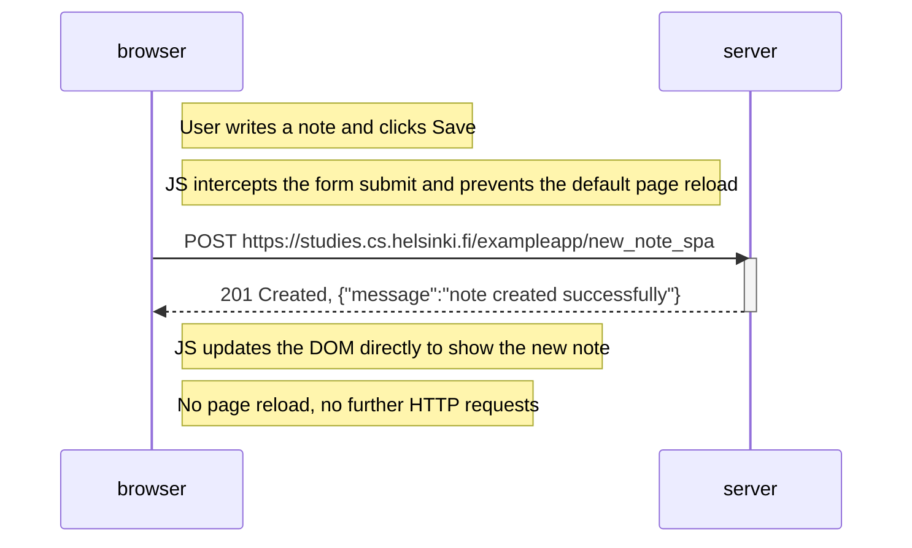

# 0.6: New note in single page app diagram

Situation: the user creates a new note in the single-page app version at
`https://studies.cs.helsinki.fi/exampleapp/spa`.

Unlike the regular page, the page does **not** reload. JavaScript intercepts the
form submit, sends the note to the server with a POST request, and updates the DOM
directly with the response.

